# Laboratorios de Ciberseguridad — Parte 2

**Autor:** Iker Alessandro Navarro Deumacan
**Carrera:** Ingeniería en Informática
**Asignatura:** Ciberseguridad

---

## Descripción

Este apartado documenta los laboratorios prácticos correspondientes a la segunda parte de la unidad **Seguridad de los Sistemas**, enfocada en la protección de la infraestructura que sostiene los datos: gestión de vulnerabilidades, parcheo, hardening y sistemas de detección de intrusos.

Cada laboratorio aborda un escenario distinto de ataque y defensa, mostrando paso a paso los comandos ejecutados, los resultados obtenidos y las medidas de mitigación aplicadas, sirviendo como evidencia técnica y guía de referencia.

---

## Entorno de trabajo

| Componente | Detalle |
|---|---|
| Virtualización | VirtualBox (red interna `192.168.56.0/24`) |
| Máquina víctima | Ubuntu Server (`192.168.56.3`) |
| Máquina atacante | Kali Linux (`192.168.56.4`) |
| Herramientas utilizadas | Nmap, apt, unattended-upgrades, Fail2Ban, Hydra, iptables |
| Diccionario de ataque | `rockyou.txt` |

---

## Estructura de esta sección

```
Parte_2/
├── README.md
└── Imagenes_Informe_Ciberseguridad/
    ├── 01.escaneo_nmap_vulnerabilidades.png
    ├── 02.cve_2026_35414.png
    └── ... 
```

---

## Laboratorio 4 — Práctica de Defensa Activa: Gestión de Parches y Hardening

### Objetivo

Implementar un proceso completo de gestión de vulnerabilidades sobre un servidor Ubuntu desactualizado: identificación de servicios vulnerables mediante escaneo automatizado, investigación de los CVE detectados en bases de datos oficiales, aplicación selectiva de parches y configuración de actualizaciones automáticas para parches críticos de seguridad.

### 1. Escaneo de vulnerabilidades con Nmap desde Kali Linux

Se realiza un escaneo con Nmap sobre la máquina víctima utilizando el conjunto de scripts `vuln`, los cuales identifican las vulnerabilidades del servidor, muestran los posibles exploits aplicables y entregan los códigos CVE asociados a cada debilidad detectada.

```bash
sudo nmap -sV --script vuln 192.168.56.3
```

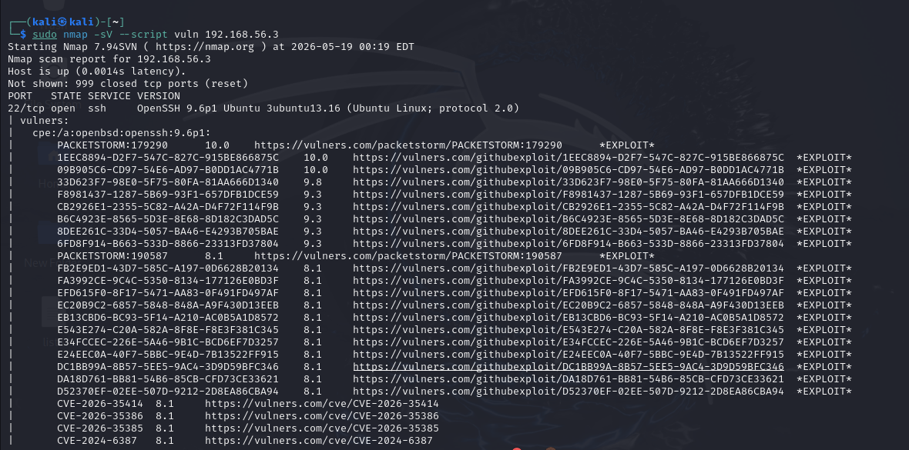

### 2. Investigación de los CVE identificados en la base de datos del NVD

A partir de los códigos entregados por el escaneo, se investigan las vulnerabilidades en la base de datos del NVD (NIST), obteniendo los siguientes CVE con su respectiva descripción:

**CVE-2026-35414** — OpenSSH antes de la versión 10.3 maneja incorrectamente la opción `authorized_keys principals` en escenarios poco comunes que involucran listas de principales junto con una Autoridad de Certificación.

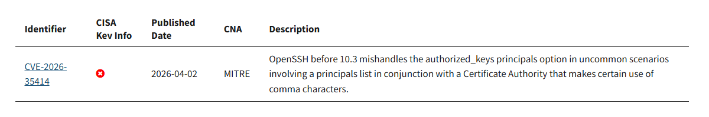

**CVE-2026-35386** — En OpenSSH antes de la versión 10.3, puede ocurrir ejecución de comandos a través de metacaracteres de shell en un nombre de usuario dentro de una línea de comando.

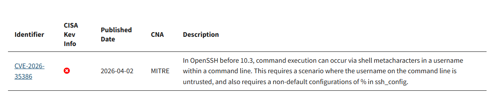

**CVE-2026-35385** — En OpenSSH antes de la versión 10.3, un archivo descargado por `scp` puede ser instalado con setuid o setgid, contrario a las expectativas del usuario.

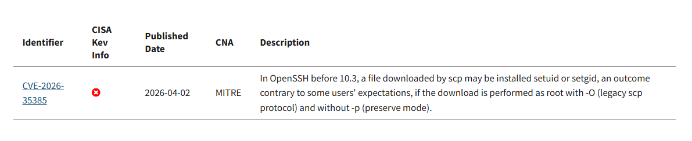

**CVE-2024-6387** — Regresión de seguridad descubierta en el servidor SSH de OpenSSH. Existe una condición de carrera que puede provocar el manejo inseguro de señales por parte de sshd, permitiendo a un atacante remoto no autenticado explotarla mediante fallos repetidos de autenticación.

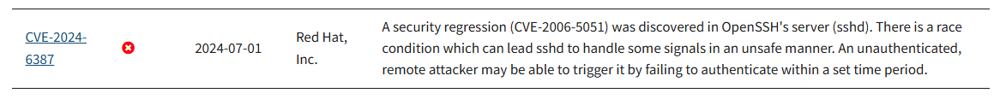

### 3. Aplicación del parche directo sobre el servicio vulnerable

Con las vulnerabilidades ya identificadas, se realiza el parcheo directo actualizando el servicio OpenSSH, sin afectar el resto de las dependencias del sistema.

```bash
sudo apt-get update && sudo apt-get install --only-upgrade openssh-server
```


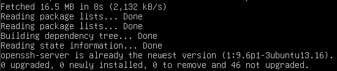

### 4. Instalación de actualizaciones automáticas de seguridad

Para automatizar la instalación de futuros parches críticos en el servidor, se instala el paquete `unattended-upgrades`.

```bash
sudo apt install unattended-upgrades
```

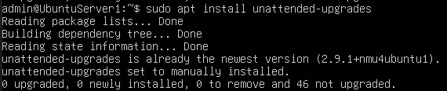

### 5. Verificación del archivo de configuración

Para validar que las actualizaciones automáticas prioricen únicamente los parches críticos de seguridad, se revisa el archivo de configuración correspondiente, donde se observa que la línea de seguridad permanece activa mientras que las demás se mantienen comentadas.

```bash
sudo nano /etc/apt/apt.conf.d/50unattended-upgrades
```

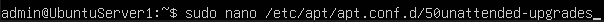

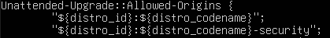

### Resultado

Con la ejecución de este laboratorio se obtiene la **capacidad de priorizar la remediación de vulnerabilidades basada en el impacto organizacional**, asegurando que los parches críticos sean instalados automáticamente y manteniendo el sistema protegido frente a versiones desactualizadas que comprometan la integridad del servidor.

---

## Laboratorio 5 — Implementación de IDS con Fail2Ban

### Objetivo

Configurar un sistema de detección de intrusos (IDS) sobre el servidor Ubuntu utilizando Fail2Ban como mecanismo de respuesta automática ante ataques de fuerza bruta sobre el servicio SSH. Validar la eficacia del sistema lanzando un ataque controlado desde Kali Linux con Hydra y comprobar el bloqueo automático del atacante en el firewall.

### 1. Instalación de Fail2Ban en el servidor Ubuntu

Se instala la herramienta Fail2Ban como sistema de detección y bloqueo automático de IPs maliciosas.

```bash
sudo apt update && sudo apt install fail2ban -y
```


### 2. Creación del archivo de configuración local

Ya instalado, se copia el archivo de configuración por defecto a `jail.local` para personalizar las reglas sin afectar la configuración original del paquete.

```bash
sudo cp /etc/fail2ban/jail.conf /etc/fail2ban/jail.local
```

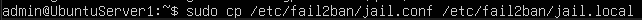

### 3. Edición del archivo jail.local

Se abre el archivo local para definir las reglas de monitoreo y bloqueo.

```bash
sudo nano /etc/fail2ban/jail.local
```

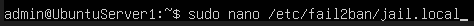

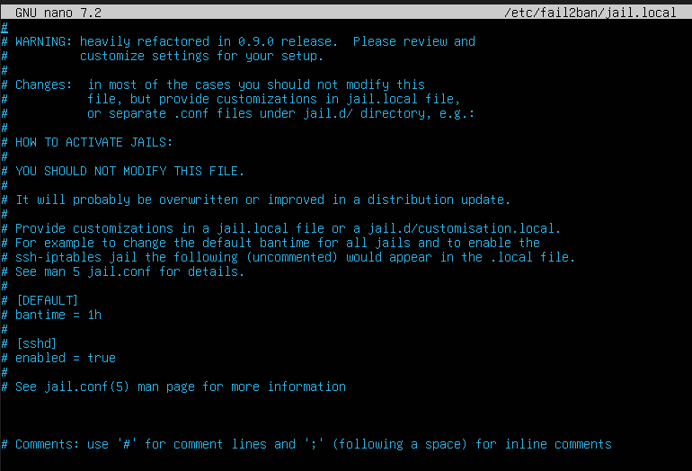

### 4. Configuración de la regla de protección sobre SSH

Dentro del archivo se configura la herramienta habilitándola sobre el puerto SSH, estableciendo un máximo de **3 intentos fallidos** y aplicando un **tiempo de bloqueo de 10 minutos** para la IP atacante.

```
[sshd]
enabled = true
port = ssh
logpath = %(sshd_log)s
backend = %(sshd_backend)s
maxretry = 3
bantime = 10m
```

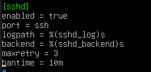

### 5. Reinicio del servicio Fail2Ban

Tras configurar el archivo, se reinicia el servicio para aplicar las nuevas reglas y activar la herramienta con la configuración actualizada.

```bash
sudo systemctl restart fail2ban
```

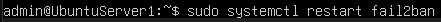

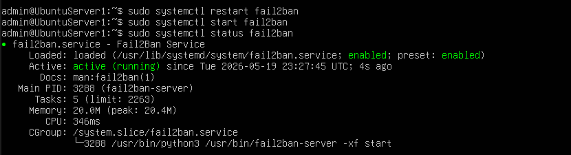

### 6. Monitoreo en tiempo real del log de Fail2Ban

Una vez activo el servicio, se inicia el monitoreo en tiempo real sobre el archivo de log de la herramienta para observar el comportamiento ante ataques.

```bash
sudo tail -f /var/log/fail2ban.log
```


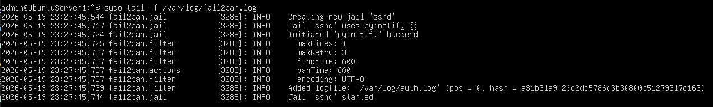

### 7. Ataque de fuerza bruta desde Kali Linux con Hydra

Mientras el monitoreo se mantiene activo en segundo plano, desde la máquina atacante se ejecuta un ataque de fuerza bruta utilizando Hydra y el diccionario `rockyou.txt` para demostrar el funcionamiento del IDS.

```bash
hydra -l admin -P rockyou.txt ssh://192.168.56.3
```

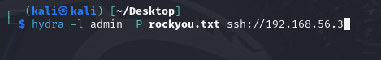

### 8. Detección y bloqueo automático del atacante

Una vez iniciado el ataque, al volver a la máquina víctima se observa cómo Fail2Ban detecta la IP atacante (`192.168.56.4`) y, tras tres intentos fallidos, procede a banearla automáticamente.

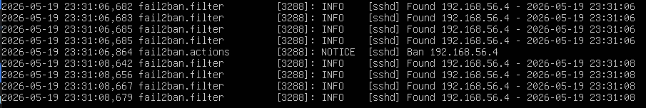

### 9. Verificación del baneo en el firewall (iptables)

Para confirmar que el bloqueo fue aplicado a nivel de firewall, se inspeccionan las reglas activas de iptables, donde aparece la IP atacante incluida en la cadena `f2b-sshd` con regla de tipo `REJECT`.

```bash
sudo iptables -L -n
```

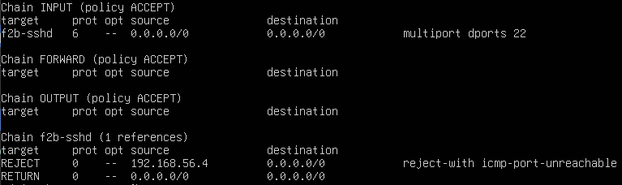

### Resultado

Con esto se demuestra que la IP atacante fue efectivamente baneada por el sistema de detección de intrusos, evidenciando el **dominio sobre sistemas de detección de intrusos y respuesta automática ante incidentes** sobre servicios críticos como SSH.

---

## Conclusiones generales

- **Laboratorio 4** demostró que la gestión proactiva de vulnerabilidades, mediante escaneo, investigación de CVE y parcheo selectivo, permite mantener la integridad del servidor sin comprometer la operatividad del resto de servicios. La configuración de actualizaciones automáticas asegura una respuesta continua ante futuras amenazas.

- **Laboratorio 5** evidenció que un sistema de detección de intrusos como Fail2Ban permite responder de manera automática y eficaz ante ataques de fuerza bruta sobre servicios expuestos, integrándose con el firewall del sistema para bloquear al atacante sin intervención manual.

En conjunto, ambos laboratorios refuerzan el principio de **defensa activa**: detectar las debilidades antes de que sean explotadas y reaccionar de forma automática frente a los intentos de intrusión, fortaleciendo así la seguridad del sistema en su totalidad.

---

*Repositorio académico — Asignatura de Ciberseguridad*
