# Laboratorios de Ciberseguridad

**Autor:** Iker Alessandro Navarro Deumacan  
**Carrera:** Ingeniería en Informática  
**Asignatura:** Ciberseguridad  

---

## Descripción

Este repositorio documenta los laboratorios prácticos realizados durante la asignatura de Ciberseguridad. Cada laboratorio aborda un escenario distinto de ataque y defensa, mostrando paso a paso los comandos ejecutados, los resultados obtenidos y las medidas de mitigación aplicadas.

El propósito del repositorio es servir como evidencia técnica y guía de referencia sobre los principales mecanismos de seguridad estudiados: integridad de archivos, autenticación robusta y cifrado de tráfico de red.

---

## Entorno de trabajo

| Componente | Detalle |
|---|---|
| Virtualización | VirtualBox (red interna `192.168.56.0/24`) |
| Máquina víctima | Ubuntu Server (`192.168.56.3`) |
| Máquina atacante | Kali Linux |
| Herramientas utilizadas | OpenSSL, SHA-256, Hydra, Google Authenticator, PAM, OpenSSH, Apache2, Wireshark |
| Diccionario de ataque | `rockyou.txt` / `lista_passwords.txt` |

---

## Estructura del repositorio

```
.
├── README.md
└── Imagenes_Informe_Ciberseguridad/
    ├── 01.crear_directorio_de_trabajo.png
    ├── 02.hash_original_archivo.png
    └── ... (30 imágenes en total)
```

---

## Lab 1 — Integridad y Firma Digital

### Objetivo

Comprobar la integridad de un archivo mediante funciones hash (SHA-256) y garantizar su autenticidad mediante firma digital con criptografía asimétrica (RSA). Se simula la alteración del archivo por un intruso para validar la detección automática del cambio.

### 1. Crear el directorio de trabajo del laboratorio

```bash
mkdir lab1
cd lab1
echo "Transferencia: cuenta 12345 monto 1000" > config_bancaria.txt
cat config_bancaria.txt
```

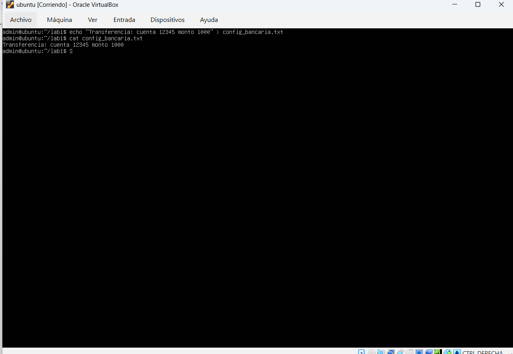

### 2. Generar la huella digital (hash) original del archivo y guardarla

```bash
sha256sum config_bancaria.txt > hash_original.txt
cat hash_original.txt
```

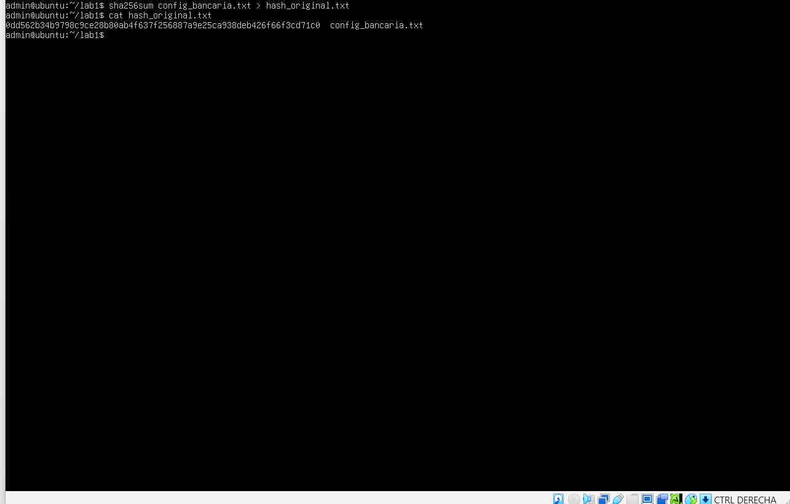

### 3. Simular el ataque de un intruso que altera el archivo

```bash
sed -i 's/1000/9999/' config_bancaria.txt
cat config_bancaria.txt
```

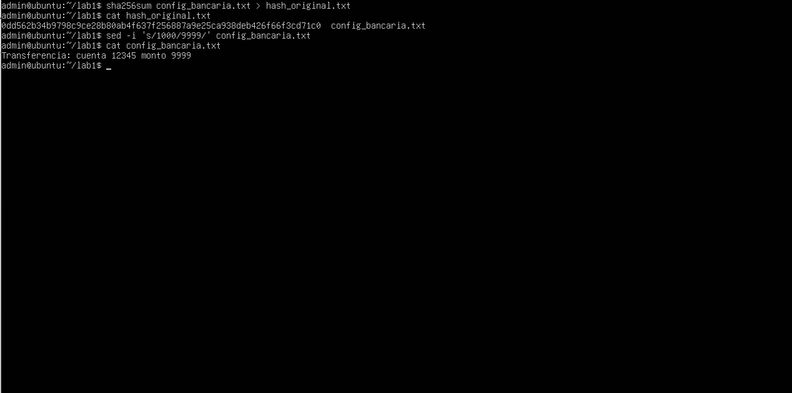

### 4. Generar un nuevo hash del archivo alterado para comparar visualmente

```bash
sha256sum config_bancaria.txt
```

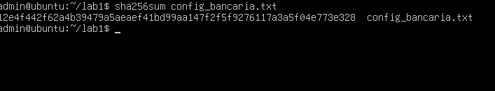

### 5. Verificar de manera automática que el archivo fue modificado (resultado esperado: `FAILED`)

```bash
sha256sum -c hash_original.txt
```

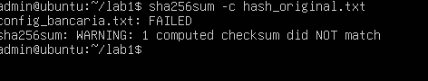

### 6. Restaurar el archivo a su contenido original

```bash
echo "Transferencia: cuenta 12345 monto 1000" > config_bancaria.txt
sha256sum -c hash_original.txt
```

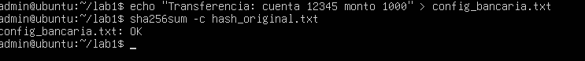

### 7. Generar la llave privada RSA y la llave pública a partir de la privada

```bash
openssl genrsa -out privada.pem 2048
openssl rsa -in privada.pem -pubout -out publica.pem
```

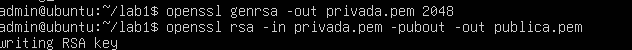

### 8. Firmar el archivo con la llave privada

```bash
openssl dgst -sha256 -sign privada.pem -out firma.bin config_bancaria.txt
```


### 9. Verificar la firma del archivo usando la llave pública (resultado esperado: `Verified OK`)

```bash
openssl dgst -sha256 -verify publica.pem -signature firma.bin config_bancaria.txt
```

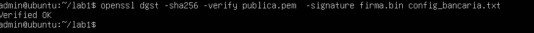

### 10. Volver a alterar el archivo y comprobar que la firma ya no es válida (resultado esperado: `Verification Failure`)

```bash
openssl dgst -sha256 -verify publica.pem -signature firma.bin config_bancaria.txt
```

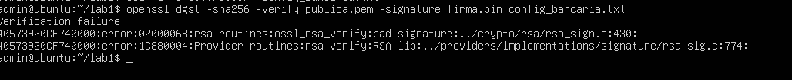

### 11. Restaurar el archivo

```bash
echo "Transferencia: cuenta 12345 monto 1000" > config_bancaria.txt
```

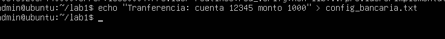

---

## Lab 2 — Ataque de SSH y defensa con MFA

### Objetivo

Demostrar la vulnerabilidad del servicio SSH ante un ataque de diccionario sin autenticación multifactor utilizando Hydra, y posteriormente aplicar hardening mediante la integración de Google Authenticator (TOTP) con PAM para exigir un segundo factor de autenticación.

### 1. Crear el usuario víctima

```bash
sudo useradd -m -s /bin/bash victima
sudo passwd victima
sudo apt update
```

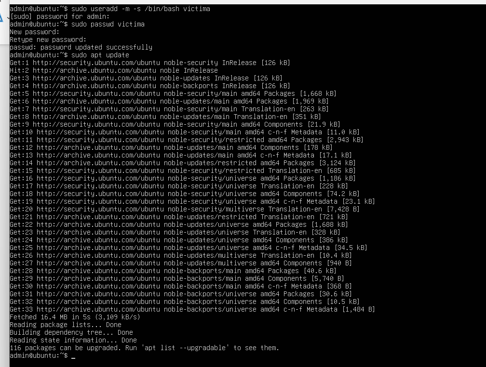

### 2. Preparar víctima (Ubuntu): instalar el servidor SSH

```bash
sudo apt install -y openssh-server
```


### 3. Activar el servidor SSH

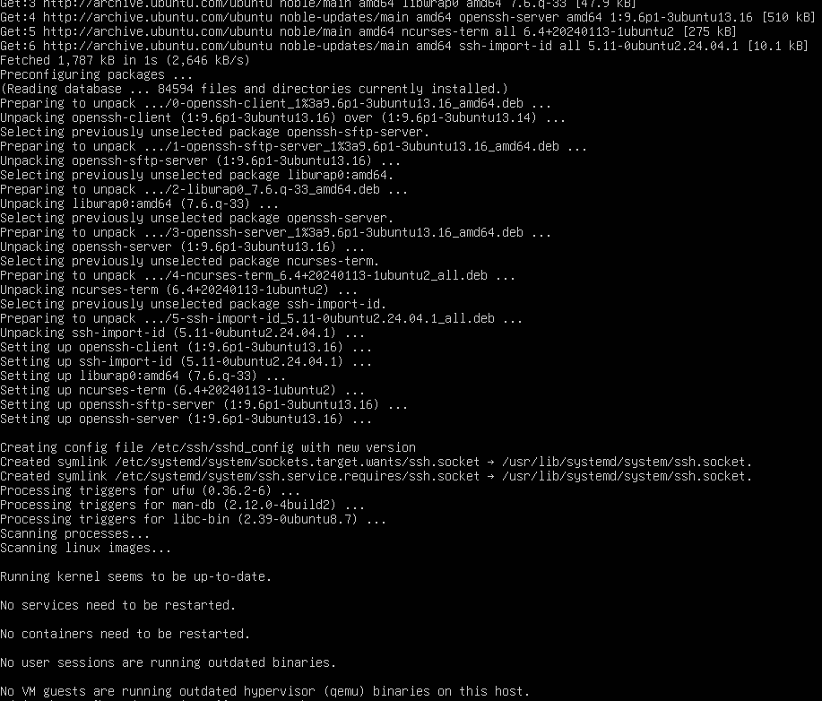

### 4. Verificar el estado del servicio SSH

```bash
sudo systemctl enable --now ssh
sudo systemctl status ssh
```

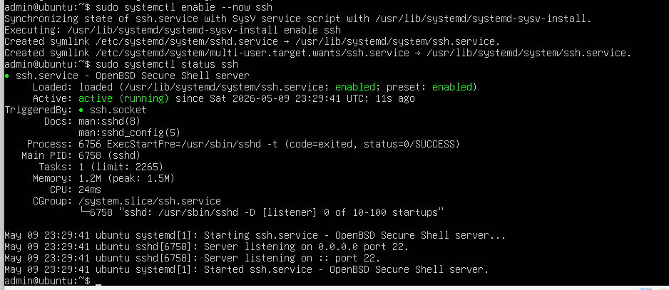

### 5. Verificar conectividad con el servidor desde Kali

```bash
ping -c 3 192.168.56.3
```

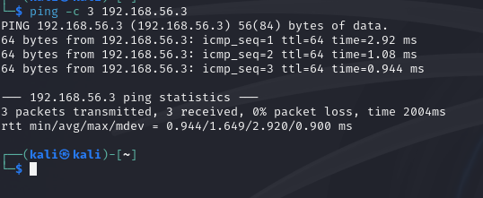

### 6. Crear diccionario de contraseñas (o utilizar `rockyou.txt`)

```bash
cat > lista_passwords.txt << EOF
123456
admin
qwerty
password
password123
letmein
EOF
```

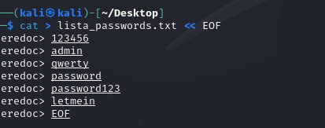

### 7. Ejecutar ataque de diccionario contra SSH — Hydra encuentra la contraseña (debilidad sin MFA)

```bash
hydra -l victima -P lista ssh://192.168.56.3 -t 4 -v
```

**Resultado:** `[22][ssh] host: 192.168.56.3 login: victima password: password123`

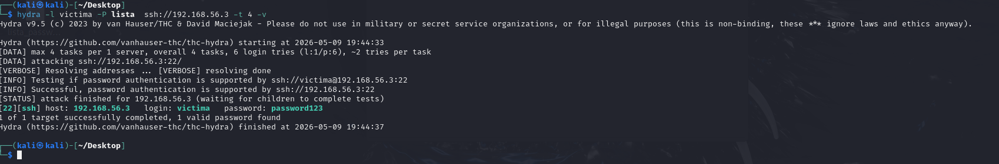

### 8. Hardening con MFA — Instalar el módulo de Google Authenticator

```bash
sudo apt install -y libpam-google-authenticator
```

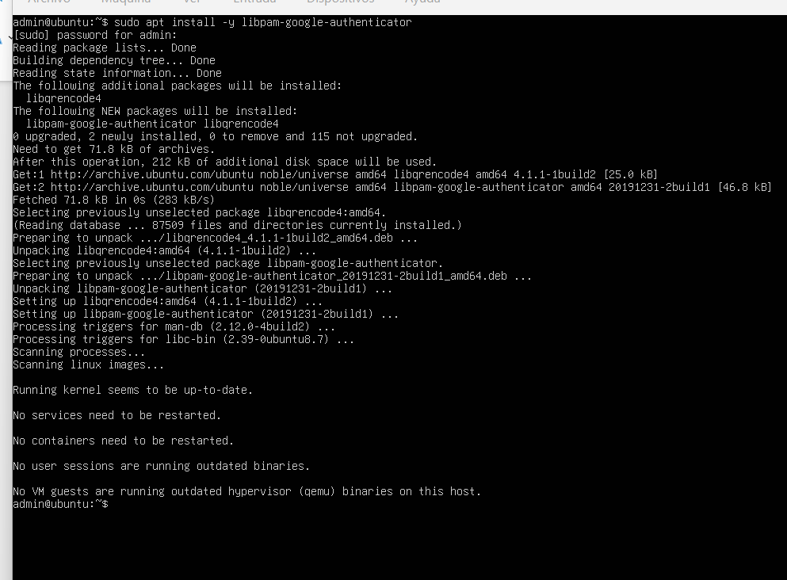

### 9. Cambiar al usuario víctima y configurar el segundo factor

```bash
su - victima
google-authenticator
```

Responder `y` a la pregunta sobre tokens basados en tiempo y escanear el código QR con la app autenticadora.

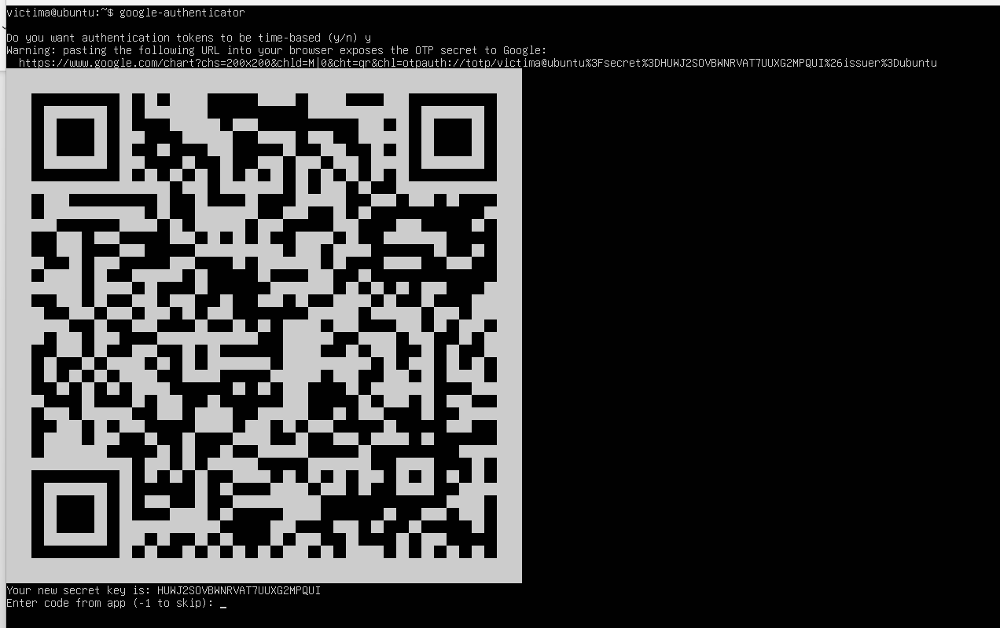

### 10. Confirmar configuración y guardar los códigos de recuperación TOTP

Responder `y` a las preguntas sobre actualización del archivo `.google_authenticator`, no reutilizar tokens, ventana de tiempo y rate-limiting.

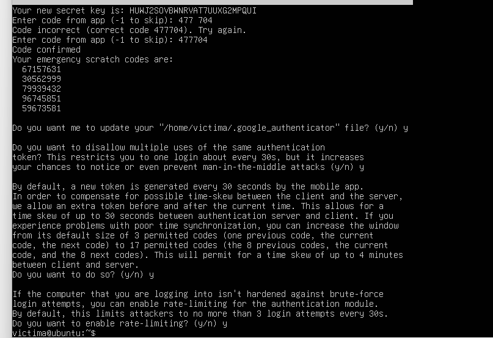

### 11. Configurar PAM para exigir el código TOTP

```bash
sudo nano /etc/pam.d/sshd
```

Agregar la siguiente línea:

```
auth required pam_google_authenticator.so
```

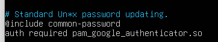

### 12. Configurar el daemon SSH para autenticación interactiva

```bash
sudo nano /etc/ssh/sshd_config
```

Agregar las siguientes líneas:

```
ChallengeResponseAuthentication yes
KbdInteractiveAuthentication yes
UsePAM yes
AuthenticationMethods keyboard-interactive
```

Reiniciar el servicio SSH:

```bash
sudo systemctl restart ssh
```

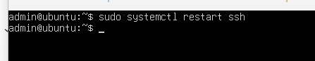

### 13. Reintentar el ataque desde Kali con Hydra — el ataque falla (eficiencia del MFA)

```bash
hydra -l victima -P lista ssh://192.168.56.3 -t 4 -v
```

**Resultado:** `1 of 1 target completed, 0 valid password found`

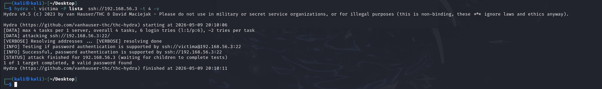

### 14. Comprobar que un usuario legítimo sí puede ingresar con su segundo factor

```bash
ssh victima@192.168.56.3
```

Ingresar contraseña + código de verificación TOTP generado por la app.

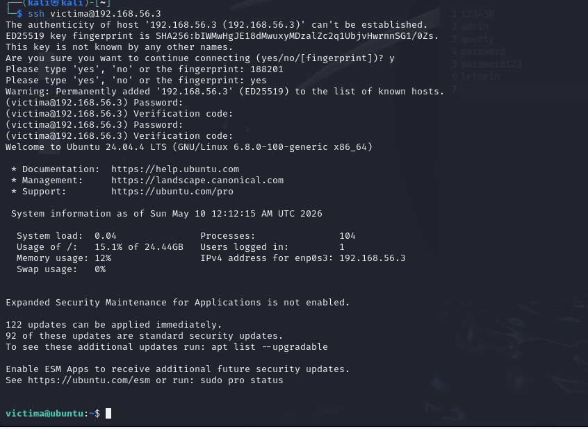

---

## Lab 3 — Sniffing de tráfico y túnel SSH

### Objetivo

Evidenciar el riesgo de transmitir credenciales en HTTP plano mediante un análisis de tráfico con Wireshark, y demostrar cómo un túnel SSH cifrado protege la información sensible que viaja por la red.

### 1. Instalar y activar el servidor Apache

```bash
sudo apt install -y apache2
sudo systemctl enable --now apache2
```

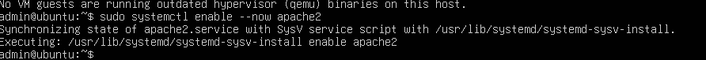

### 2. Crear el formulario de login en HTTP plano

```bash
sudo nano /var/www/html/login.html
```

Contenido del archivo:

```html
<!DOCTYPE html>
<html><body>
<h2> LOGIN (HTTP - INSEGURO) </h2>
<form method="POST" action="/login.html">
Usuario:<input name="user"><br>
Password:<input type="password" name="pass"><br>
<button type="submit">Entrar</button>
</form>
</body></html>
```

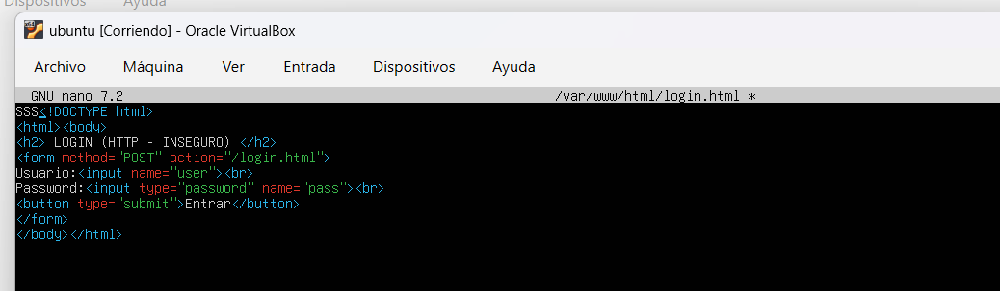

### 3. Acceder a `login.html` desde Kali y filtrar el método `POST` en Wireshark para visualizar las credenciales

En Wireshark aplicar el filtro:

```
http.request.method == "POST"
```

**Resultado:** las credenciales viajan en texto plano y son visibles (`user = hola`, `pass = 123`).

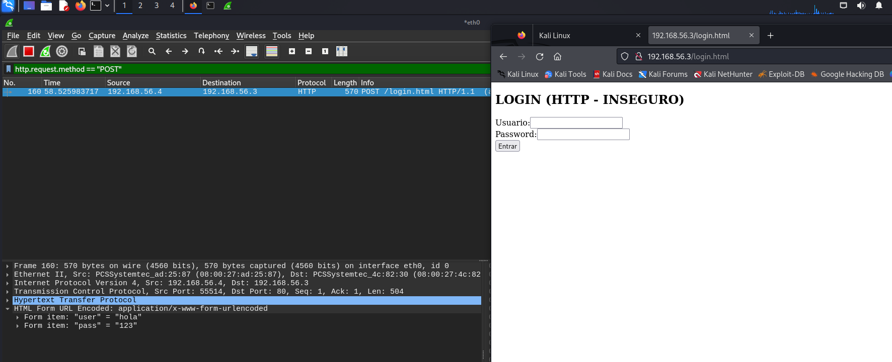

### 4. Crear un túnel SSH cifrado hacia el servidor web y acceder al formulario por el túnel local

```bash
ssh -L 8080:localhost:80 victima@192.168.56.3
```

Acceder en el navegador a:

```
http://localhost:8080/login.html
```

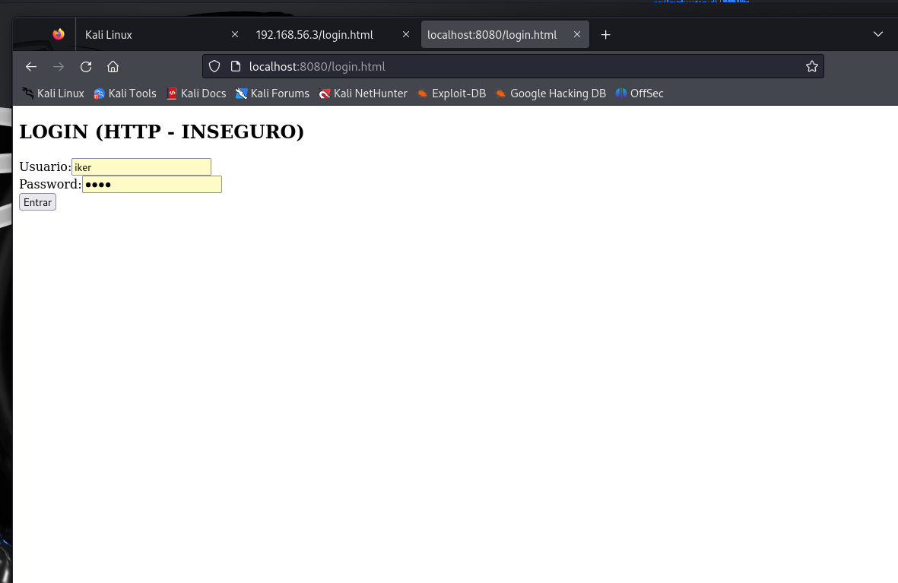

### 5. Verificación de encriptación con Wireshark

Aplicar el filtro:

```
tcp.port == 22
```

**Resultado:** todos los paquetes aparecen como `Encrypted packet`, demostrando que el tráfico está cifrado.

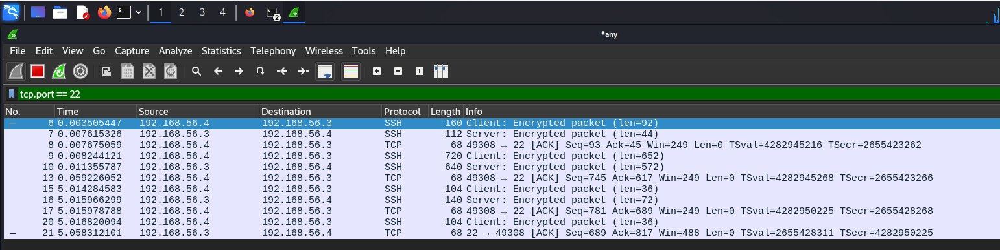

### Opcional

- Implementar VPN para extender el cifrado a toda la comunicación entre cliente y servidor.

---

## Conclusiones generales

- **Lab 1** demostró que las funciones hash detectan cualquier alteración del archivo, y que la firma digital RSA garantiza tanto la integridad como la autenticidad del origen.
- **Lab 2** evidenció que SSH con sólo contraseña es vulnerable a ataques de diccionario, mientras que la incorporación de MFA con TOTP eleva drásticamente la seguridad del acceso remoto.
- **Lab 3** mostró que el tráfico HTTP plano expone credenciales sensibles y que el uso de túneles SSH (o VPN) es indispensable para proteger la información en tránsito.

---

*Repositorio académico — Asignatura de Ciberseguridad*
